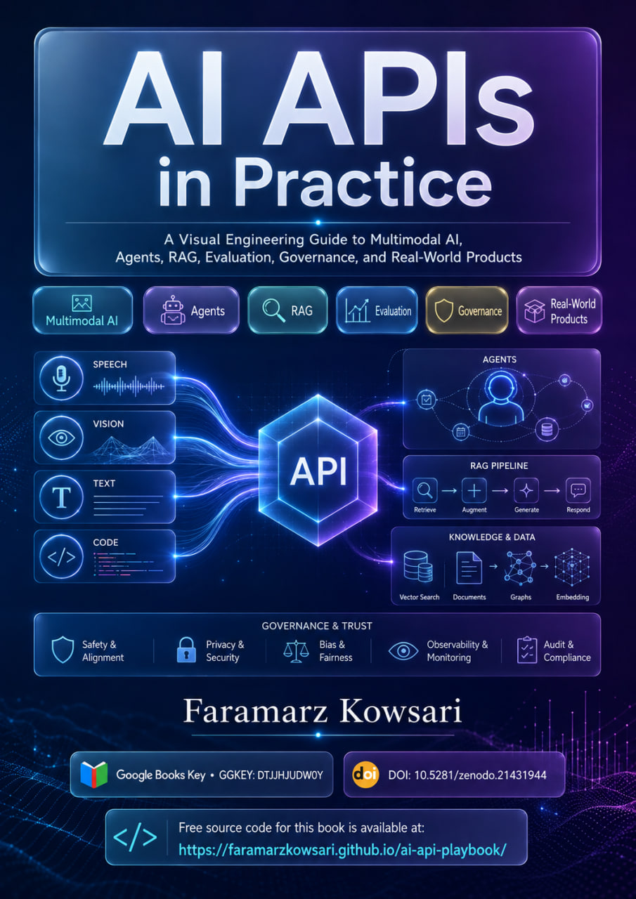

# AI APIs in Practice

**A Visual AI API Playbook for Multimodal, Agentic, Production-Ready, and Commercial Applications**

[](https://doi.org/10.5281/zenodo.21419466)
[](https://doi.org/10.5281/zenodo.21431944)
[](https://play.google.com/store/books/details?id=nx_2EQAAQBAJ)
[](book/ai-apis-in-practice-faramarz-kowsari-2026.pdf)
[](LICENSE)
[](book/LICENSE.md)

> **Run the executable showcase:** [Open in Google Colab](https://colab.research.google.com/github/FaramarzKowsari/ai-api-playbook/blob/main/notebooks/00_quickstart_colab.ipynb) · [View saved outputs on GitHub](notebooks/00_quickstart_colab.ipynb)

---
## Official Project Website

https://faramarzkowsari.github.io/ai-api-playbook/

## Project overview

**AI APIs in Practice** is an open research-software project by **Faramarz Kowsari**. It translates modern AI API capabilities into reproducible engineering patterns, offline-testable examples, safety utilities, evaluation workflows, and commercially realistic product blueprints.

The repository is organized by durable capabilities rather than rapidly changing model names. It covers language models, structured outputs, tool use, agents, RAG, multimodal systems, image generation, OCR, speech, realtime interaction, video, routing, evaluation, safety, observability, and unit economics.

The default configuration runs in deterministic mock mode and does not require paid API credentials.

> **Status:** First public engineering edition, version 1.0.0. Provider availability, model names, prices, SDK interfaces, and regional access may change. Consult the [provider matrix](docs/provider-matrix.md) and each provider’s current official documentation before production deployment.

## Quick links

| Resource | Link |
|---|---|
| Executable Google Colab showcase | [Open and run](https://colab.research.google.com/github/FaramarzKowsari/ai-api-playbook/blob/main/notebooks/00_quickstart_colab.ipynb) |
| Saved program outputs | [View Notebook](notebooks/00_quickstart_colab.ipynb) |
| Source-code examples | [Browse examples](examples/) |
| Commercial product blueprints | [Browse projects](projects/) |
| Architecture documentation | [Read architecture guide](docs/architecture.md) |
| Provider coverage | [View provider matrix](docs/provider-matrix.md) |
| Automated test runs | [GitHub Actions](https://github.com/FaramarzKowsari/ai-api-playbook/actions) |
| Version 1.0.0 release | [GitHub Release](https://github.com/FaramarzKowsari/ai-api-playbook/releases/tag/v1.0.0) |
| Permanent scientific record | [Zenodo DOI](https://doi.org/10.5281/zenodo.21419466) |
| Machine-readable citation | [CITATION.cff](CITATION.cff) |
| Complete book PDF | [Read or download](book/ai-apis-in-practice-faramarz-kowsari-2026.pdf) |
| Book record and DOI | [Zenodo Book Record](https://doi.org/10.5281/zenodo.21431944) |
| Google Books edition | [View on Google Books](https://play.google.com/store/books/details?id=nx_2EQAAQBAJ) |
| Companion software DOI | [Zenodo Software Record](https://doi.org/10.5281/zenodo.21419466) |

## What makes this repository different

- Capability-first organization instead of a fragile catalog of model names.
- Safe deterministic mock mode requiring no paid API credentials.
- Runnable examples connected to documented engineering concepts.
- Python reference implementation plus TypeScript browser and realtime patterns.
- Structured outputs, routing, safety, evaluation, RAG, and cost-management utilities.
- Production concerns including retries, timeouts, redaction, idempotency, and observability.
- Automated CI validation across Python 3.11, 3.12, and 3.13.
- Book-to-code traceability through a numbered infographic production map.
- Commercial blueprints based on measurable customer outcomes and unit economics.
- Permanent preservation and scientific citation through Zenodo.

## Executable showcase

The included Colab Notebook demonstrates the project without requiring an API key:

1. Provider-neutral text generation
2. Schema-constrained structured output
3. Balanced model routing
4. AI-product unit economics
5. Privacy redaction
6. Prompt-injection detection

### Example output: provider-neutral generation

```python
{
    "text": "Mock response for: Explain RAG in one sentence.",
    "provider": "openai",
    "model": "configured-model",
    "usage": {
        "input_tokens": 7,
        "output_tokens": 11,
        "estimated_cost_usd": 0.0
    },
    "mode": "mock"
}
```

### Example output: structured response

```python
{
    "summary": "mock-summary",
    "risk": "mock-risk"
}
```

### Example output: model routing

```python
{
    "provider": "anthropic",
    "model": "balanced-model",
    "strategy": "balanced"
}
```

### Example output: unit economics

```python
{
    "gross_profit_usd": 1.30,
    "gross_margin_percent": 86.7
}
```

### Example output: safety controls

```python
{
    "redacted": "Contact [EMAIL]; api_key=[REDACTED]",
    "prompt_injection_detected": true
}
```

[Run all examples in Google Colab](https://colab.research.google.com/github/FaramarzKowsari/ai-api-playbook/blob/main/notebooks/00_quickstart_colab.ipynb)

## Local installation

### Clone the repository

```bash
git clone https://github.com/FaramarzKowsari/ai-api-playbook.git
cd ai-api-playbook
```

### Create a virtual environment

```bash
python -m venv .venv
```

Windows PowerShell:

```powershell
.venv\Scripts\Activate.ps1
Copy-Item .env.example .env
```

macOS or Linux:

```bash
source .venv/bin/activate
cp .env.example .env
```

### Install and run

```bash
pip install -e ".[dev]"
python -m ai_api_playbook.cli demo
python -m unittest discover -s tests -v
```

The default configuration uses deterministic mock responses. To call a live provider, add the required credential to `.env`, set `AIAP_MODE=live`, and explicitly configure the provider integration.

Never place API keys directly inside source files, notebooks, browser code, screenshots, logs, or Git commits.

## Repository map

| Path | Purpose |
|---|---|
| `src/ai_api_playbook/` | Provider-neutral core, configuration, routing, RAG, safety, evaluation, and economics |
| `examples/` | Focused provider and capability examples |
| `projects/` | Commercial product blueprints and proof-of-concept pipelines |
| `notebooks/` | Executable Colab showcase with saved outputs |
| `docs/` | Architecture, provider matrix, book map, security, and release guidance |
| `book/` | Complete visual book, cover, book citation metadata, and book-specific license |
| `tests/` | Deterministic offline tests requiring no provider credentials |
| `tools/` | Supporting documentation and manuscript-generation utilities |
| `.github/workflows/` | Continuous-integration configuration |

## Capability map

1. **API foundations:** REST, streaming, SSE, WebSocket, WebRTC, asynchronous jobs, webhooks, and batch processing.
2. **Language and reasoning:** prompting, structured outputs, code generation, multimodality, and reasoning workflows.
3. **Tools and agents:** function calling, search, code execution, computer use, MCP, and agent orchestration.
4. **Knowledge systems:** embeddings, chunking, vector stores, hybrid retrieval, reranking, and RAG evaluation.
5. **Media systems:** vision, OCR, image generation, speech, realtime voice, video, avatars, music, and sound.
6. **Production engineering:** secrets, privacy, retries, rate limits, caching, evaluation, observability, and cost controls.
7. **Commercial systems:** customer problems, measurable outcomes, cost per successful job, pricing, safeguards, and human review.

## Supported provider families

The repository contains configurations, examples, or documented integration patterns for:

- OpenAI
- Google Gemini
- Anthropic Claude
- Microsoft Foundry
- Mistral
- Hugging Face Inference Providers
- Cohere
- Pinecone
- ElevenLabs
- Deepgram
- Runway
- Replicate

See the [provider matrix](docs/provider-matrix.md) for exact coverage and verification details.

Browser and realtime examples require short-lived credentials minted by a secure backend. Never ship permanent provider keys to browsers, mobile applications, or public repositories.

## Selected examples

| Capability | Example |
|---|---|
| OpenAI Responses | [`examples/01_text/openai_responses.py`](examples/01_text/openai_responses.py) |
| Google Gemini | [`examples/01_text/gemini_interactions.py`](examples/01_text/gemini_interactions.py) |
| Anthropic Claude | [`examples/01_text/anthropic_messages.py`](examples/01_text/anthropic_messages.py) |
| Microsoft Foundry | [`examples/01_text/microsoft_foundry.py`](examples/01_text/microsoft_foundry.py) |
| Function calling | [`examples/02_tools/function_calling.py`](examples/02_tools/function_calling.py) |
| Model Context Protocol contract | [`examples/02_tools/mcp_tool_contract.json`](examples/02_tools/mcp_tool_contract.json) |
| Local RAG | [`examples/03_rag/local_rag.py`](examples/03_rag/local_rag.py) |
| Mistral OCR | [`examples/04_documents/mistral_ocr.py`](examples/04_documents/mistral_ocr.py) |
| Image generation | [`examples/05_media/openai_image_generation.py`](examples/05_media/openai_image_generation.py) |
| Speech-to-text | [`examples/05_media/deepgram_stt.py`](examples/05_media/deepgram_stt.py) |
| Text-to-speech | [`examples/05_media/elevenlabs_tts.py`](examples/05_media/elevenlabs_tts.py) |
| Realtime WebRTC | [`examples/05_media/realtime_browser.ts`](examples/05_media/realtime_browser.ts) |
| Video generation | [`examples/05_media/runway_video.py`](examples/05_media/runway_video.py) |
| Hugging Face routing | [`examples/06_gateways/huggingface_router.py`](examples/06_gateways/huggingface_router.py) |
| Replicate | [`examples/06_gateways/replicate_model.py`](examples/06_gateways/replicate_model.py) |
| Cohere reranking | [`examples/07_search/cohere_rerank.py`](examples/07_search/cohere_rerank.py) |
| Pinecone vector storage | [`examples/07_search/pinecone_vector_store.py`](examples/07_search/pinecone_vector_store.py) |

## Commercial blueprints

The `projects/` directory contains revenue-oriented product blueprints built around:

- A recurring customer problem
- A clearly measurable outcome
- A defined human-review boundary
- Cost per successful job
- Pricing assumptions
- Safety and privacy controls
- Evaluation before automation

These blueprints are educational product-design references, not guarantees of income or commercial success.

## Quality assurance

Every push and pull request triggers automated validation through GitHub Actions.

The current workflow includes:

- Ruff static analysis
- Strict Mypy type checking
- Pytest and coverage execution
- Python 3.11 validation
- Python 3.12 validation
- Python 3.13 validation
- Offline deterministic testing
- Notebook JSON validation during project development

View the latest status in [GitHub Actions](https://github.com/FaramarzKowsari/ai-api-playbook/actions).

## Security baseline

- Never commit API keys or provider secrets.
- Keep privileged credentials on secure server-side infrastructure.
- Use ephemeral or session credentials for client-side realtime applications.
- Redact secrets and personal data from logs.
- Validate tool inputs and structured outputs.
- Require human approval for high-impact operations.
- Verify webhook signatures.
- Use idempotency keys for billable or mutating operations.
- Add rate limits, budgets, monitoring, and emergency shutdown controls.
- Treat retrieved documents and external tool responses as untrusted input.

Read [`SECURITY.md`](SECURITY.md) before enabling live mode.

## Scientific citation

This software release is permanently archived by Zenodo.

- **Title:** AI APIs in Practice: Visual AI API Playbook
- **Author:** Faramarz Kowsari
- **Version:** 1.0.0
- **Release date:** 2026-07-17
- **DOI:** https://doi.org/10.5281/zenodo.21419466
- **Resource type:** Software
- **License:** MIT

### BibTeX

```bibtex
@software{Kowsari_AI_APIs_in_2026,
  author = {Kowsari, Faramarz},
  doi = {10.5281/zenodo.21419466},
  license = {MIT},
  month = jul,
  title = {{AI APIs in Practice: Visual AI API Playbook}},
  url = {https://github.com/FaramarzKowsari/ai-api-playbook},
  version = {1.0.0},
  year = {2026}
}
```

Machine-readable citation metadata is available in [`CITATION.cff`](CITATION.cff) and [`.zenodo.json`](.zenodo.json).


## Companion Visual Book

<p align="center">
  <a href="book/ai-apis-in-practice-faramarz-kowsari-2026.pdf">
    
  </a>
</p>

### AI APIs in Practice

**A Visual Engineering Guide to Multimodal AI, Agents, RAG, Evaluation, Governance, and Real-World Products**

The complete visual book is included in this repository as the publishing and educational companion to the executable software project.

The book transforms the architecture, implementation, evaluation, safety, governance, and commercial design of AI API systems into structured visual lessons. It connects each major engineering concept with runnable examples, repository paths, product considerations, and production-oriented practices.

| Resource | Link |
|---|---|
| Complete PDF | [Read or download the book](book/ai-apis-in-practice-faramarz-kowsari-2026.pdf) |
| Book DOI | [10.5281/zenodo.21431944](https://doi.org/10.5281/zenodo.21431944) |
| Zenodo record | [Book archive](https://zenodo.org/records/21431944) |
| Google Books | [Official book page](https://play.google.com/store/books/details?id=nx_2EQAAQBAJ) |
| Companion software DOI | [10.5281/zenodo.21419466](https://doi.org/10.5281/zenodo.21419466) |
| Source repository | [AI API Playbook](https://github.com/FaramarzKowsari/ai-api-playbook) |

### Book and Software Relationship

The book and software are separate but connected research objects:

- The **book** provides the visual engineering framework and educational architecture.
- The **software** provides executable examples, tests, utilities, notebooks, and product blueprints.
- Each resource has its own DOI, citation metadata, and license.

## Author

**Faramarz Kowsari** is an author, Software Engineer, and AI Researcher based in Istanbul. Focusing on the intersection of technology, education, and personal growth, he has published over 80 digital titles on international platforms.

His areas of expertise span Artificial Intelligence, prompt engineering, modern trading strategies—including Smart Money Concepts and algorithmic trading—as well as classical literature and mindfulness. In addition to writing, he develops web-based educational tools and creates specialized instructional video content.

### Official profiles and repositories

- Wikidata: https://www.wikidata.org/wiki/Q140389378
- ORCID: https://orcid.org/0000-0003-1692-0453
- Google Scholar: https://scholar.google.com/citations?user=G7tP5WMAAAAJ&hl=en
- GitHub: https://github.com/FaramarzKowsari
- LinkedIn: https://www.linkedin.com/in/faramarzkowsari
- Google Books: https://play.google.com/store/search?q=Faramarz_Kowsari&c=books

## Contributing

Constructive contributions are welcome. Before submitting a pull request:

1. Read [`CONTRIBUTING.md`](CONTRIBUTING.md).
2. Do not include credentials, private data, or copyrighted provider documentation.
3. Add or update deterministic tests.
4. Run the local quality checks.
5. Explain the engineering or educational value of the change.

## License

The software source code in this repository is released under the [MIT License](LICENSE).

The companion book included in the `book/` directory is a separate published work with its own DOI and Creative Commons Attribution 4.0 International License. It is not covered by the repository’s MIT software license.

---

**Repository:** https://github.com/FaramarzKowsari/ai-api-playbook  
**DOI:** https://doi.org/10.5281/zenodo.21419466  
**Release:** https://github.com/FaramarzKowsari/ai-api-playbook/releases/tag/v1.0.0
