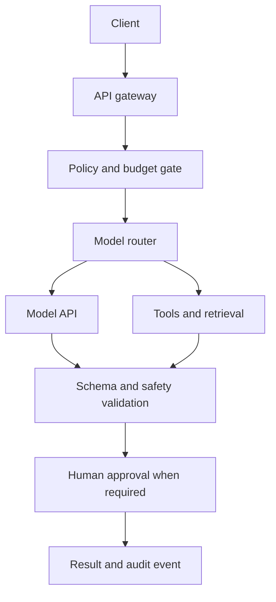

# Reference architecture

## Boundaries

- The client never receives a privileged provider key.
- The policy gate authenticates the caller, enforces quotas, and blocks unsupported actions.
- The router chooses by measured quality, latency, cost, region, and availability.
- Tool outputs and retrieved documents are untrusted data.
- The validator checks schema, evidence, safety, and budget before a result is committed.
- Human approval is mandatory for irreversible or person-directed actions.

## Request lifecycle

Every production request should carry a correlation ID, tenant ID, purpose, model policy, timeout, maximum cost, and idempotency key when the operation can create a charge or change state. Logs should record hashes and safe metadata rather than raw sensitive prompts.
